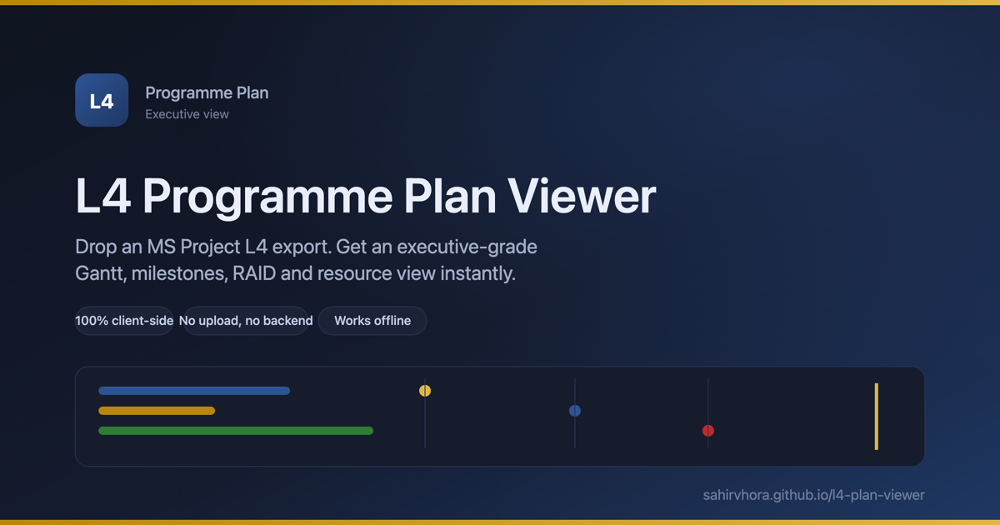

# L4 Programme Plan Viewer

[](https://sahirvhora.github.io/l4-plan-viewer/)
[](https://github.com/SahirVhora/l4-plan-viewer/actions/workflows/deploy-pages.yml)


A fully client-side dashboard for a Level-4 (L4) programme plan exported from MS Project as an Excel workbook. Drop the workbook in, and it renders an executive-grade Dashboard, Gantt, Task table, Milestones, RAID (Assumptions & Decisions) and Resources view. Everything runs in the browser: parsing, rendering, filtering, CSV export and print/PDF export. Nothing is uploaded anywhere, and the app works fully offline once built.



**Live:** https://sahirvhora.github.io/l4-plan-viewer/

## Running it

```bash
npm install
npm run dev
```

Open the printed local URL. You will land on an empty drop zone; drag your workbook onto it, or click to browse.

## Building

```bash
npm run build
```

Produces a static bundle in `dist/`. Open `dist/index.html` directly (or serve the folder with any static file server) — no backend, no environment variables, no build-time secrets.

## Loading your plan

Drop `CST238_SuccessFactors_Detailed_MS_Project_Import_Plan_v3.xlsx` (or any workbook following the same column layout) onto the drop zone, or use "Load / replace file" in the top bar once a plan is loaded. The app always starts on the empty drop zone — it never auto-loads real data.

To see the app populated without a real file, use the "Try it with the sample plan" button on the drop zone, or download `public/sample/L4-sample-plan.xlsx` directly. It's a synthetic 37-task, 9-milestone programme (no real client data) that exercises every column and every view: multi-level hierarchy, dependencies with lag, a payment-gate milestone, RAID items, MD Brief priorities, and a spread of complete/in-progress/at-risk/late tasks. Use it as a reference for the exact column layout an input workbook needs.

The workbook is expected to contain these sheets (matched case-insensitively, trimmed): `MS Project Import` (required), `Milestone Summary`, `MD Brief`, `Resource Dictionary`, `Assumptions Decisions`, `Import Guide` (not surfaced in the UI). Missing optional sheets degrade gracefully — the relevant panel says so instead of crashing.

## Tests

```bash
npm run test
```

21 Vitest unit tests cover the trickiest pure logic: Excel date-serial parsing, predecessor token parsing (`26FS`, `81SS+5d`, negative lag), outline-level hierarchy construction, summary date roll-up, RAG health derivation, and an end-to-end parse of a synthetic fixture workbook that mirrors the real column layout.

## Structure

```
src/
  parsing/     workbook -> typed model (parseWorkbook.ts is the single entry point)
  model/       types, health/RAG derivation, selectors (rollups, breakdowns, resource load), CSV export
  state/       zustand store (view, filters, search, theme, selection) + filtered-task selector
  components/  Sidebar, TopBar, FilterChips, DropZone, KpiCard, MilestoneTimeline, PaymentDonut,
               TaskDrawer, PrintLayout, and gantt/ (GanttChart, ganttMath, ganttRuler)
  views/       Dashboard, GanttView, TableView, MilestonesView, RaidView, ResourcesView
  theme/       RAG colour/icon mapping, track/module colour helpers
  test-fixtures/ synthetic workbook builder used by parseWorkbook.test.ts
```

`parseWorkbook(file)` is the only entry point into parsing. It finds the header row defensively (scans the first 10 rows for one containing ID/WBS/Task Name/Outline Level), builds the hierarchy from Outline Level (not WBS), rolls up Summary/Milestone dates, parses predecessor tokens, derives per-task health, and cross-checks the outline-derived tree against WBS (logging a console warning and surfacing a data note on mismatch, never throwing).

## Design decisions and assumptions

- **Health/RAG logic** (`src/model/health.ts`) is a single pure function: complete if Status is Complete or 100%; blocked/late if Finish is in the past and not complete; at-risk if on the critical path, not started, and starting within 14 days (or already overdue to start); on-track otherwise. Adjust the threshold in one place.
- **Print/PDF export** (`src/components/PrintLayout.tsx`) renders a separate, non-interactive, page-break-friendly layout (cover + KPIs, milestone table, a flat landscape Gantt-style listing, full task table) rather than trying to paginate the live Gantt or the virtualised table — both use absolute positioning and row virtualisation that don't paginate correctly in print. Trigger it with the "Print / Export PDF" button, then "Save as PDF" in the browser's print dialog.
- **Filters and search** are centralised in `state/store.ts` and `state/filteredTasks.ts` and applied identically across Gantt, Table and Resources. Theme and filters persist to `localStorage`.
- **Percent complete normalisation**: values `<= 1` are treated as fractions (0-1) and scaled to 0-100; anything else is used as-is.
- **Payment percentages**: same 0-1 vs 0-100 detection. If the nine milestones' payment percentages don't sum to ~100%, a warning appears in the Dashboard's "Data notes" panel instead of failing silently.
- **Large plans**: the Task table uses `@tanstack/react-virtual` for row virtualisation; the Gantt renders only visible (filtered) rows. Both were smoke-tested but the bundled synthetic fixtures are small — if you load a very large plan (1000+ rows) and notice jank, that's the first place to look.
- **Known dependency advisory**: the `xlsx` (SheetJS) package on the npm registry has two published advisories (prototype pollution, ReDoS) with no npm-registry fix available at time of writing. Risk is limited to processing a maliciously crafted local file you choose to open yourself — there's no network exposure — but worth knowing if you later swap in an untrusted-file-upload flow.
- **No sample data is bundled.** Use your own `CST238_...xlsx` export, or run `npm run test` to see the parser exercised against an in-repo synthetic fixture (`src/test-fixtures/buildFixtureWorkbook.ts`).

## Verified before calling this done

- `npm install && npm run dev` starts clean; empty state shows the drop zone.
- A workbook matching the documented layout populates all six views; a workbook missing the `MS Project Import` sheet shows a specific, named error instead of crashing.
- Gantt hierarchy, bar positions, milestone diamonds, critical-path styling and dependency connectors all checked visually against a multi-level synthetic fixture.
- Filters, search, and the Task Detail drawer (with clickable predecessor/successor chips) work consistently across Gantt, Table and Resources.
- Light and dark themes both render correctly; `prefers-reduced-motion` is respected via a global CSS override.
- Print output produces a clean, paginated, landscape layout with no sidebar/topbar bleed-through.
- `npm run test` (21 tests) and `npm run build` both pass with no console errors.
